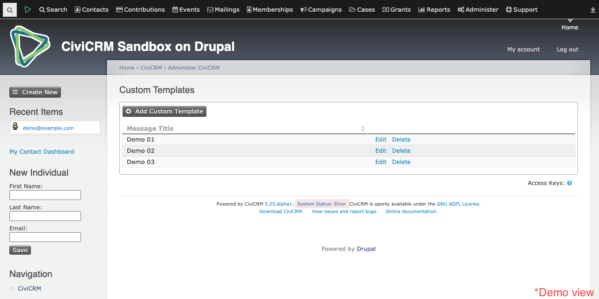
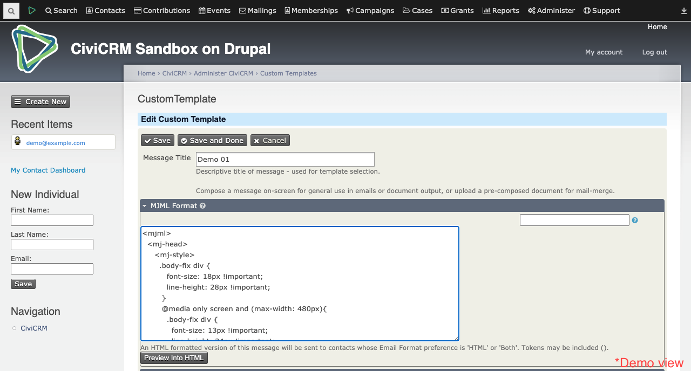
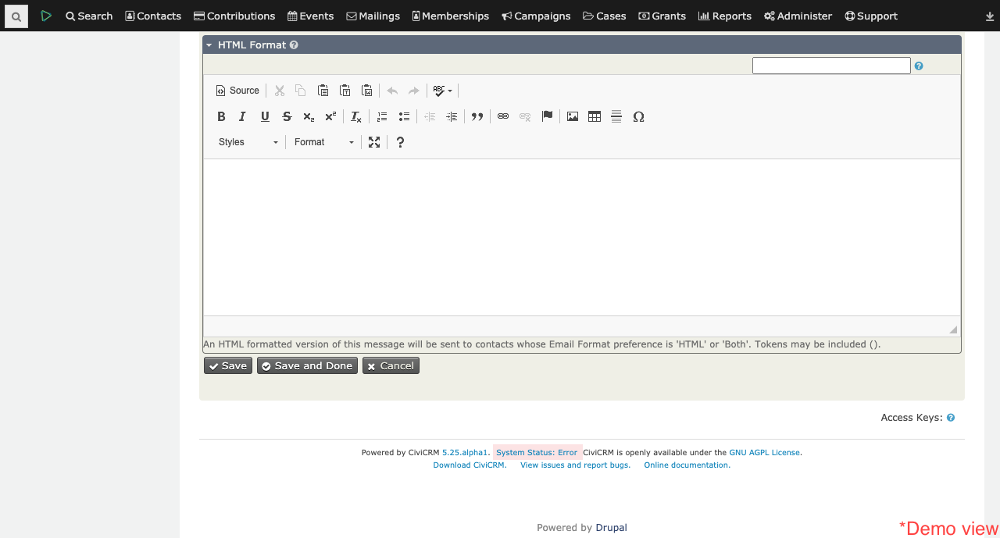
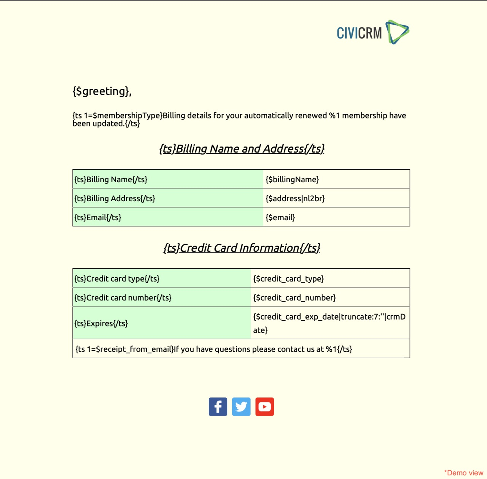
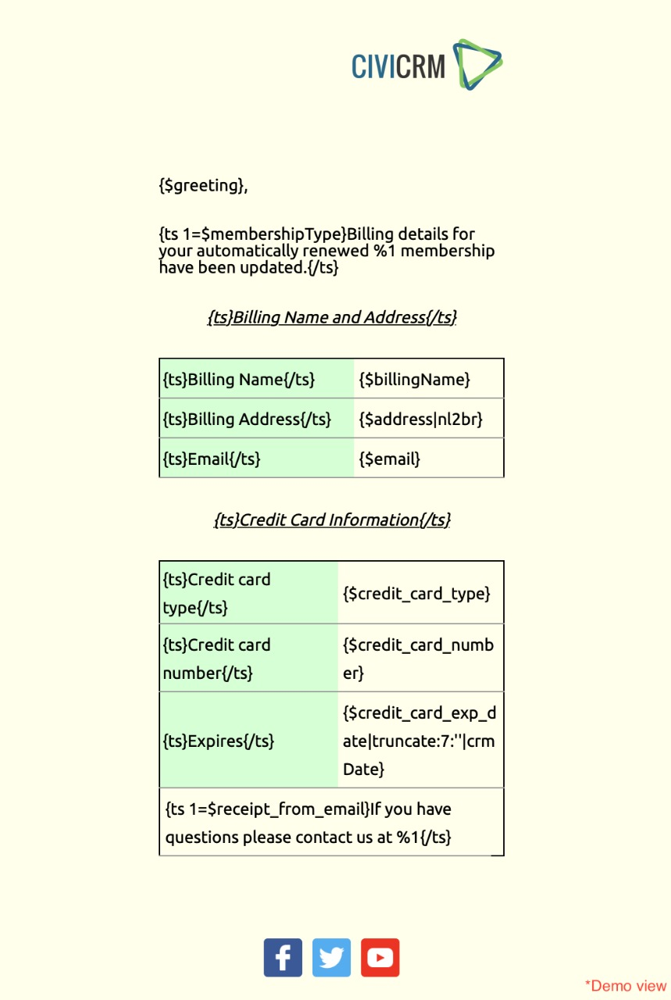

# Custom Made - A transactional email template creator.

This extension will help in follow the most straightforward approach to maximize efficiency and lower development time and help in producing engaging and interactive email templates. It allows the user a range of opportunities to customize and embellish their email templates and produces the best result for audiences. The templates made with it are quite responsive, understandable, and flexible in nature.

The extension is licensed under [AGPL-3.0](LICENSE.txt).

## Requirements

* PHP v7.0+
* CiviCRM v5.24+

## Installation (Web UI)
This extension has not yet been published for installation via the web UI.

## Installation (CLI, Git)
Sysadmins and developers may clone the Git repo for this extension, make sure to run “npm install” inside of the project directory to download the required javascript dependencies.

```
If you are using buildkit, get to the ext folder:
cd  build/dmaster/web/sites/default/files/civicrm/ext

git clone https://github.com/PratikDevlekar/GSoC.git
cd com.civicrm.custommade01
npm install
```

Install it with the command-line tool [cv](https://github.com/civicrm/cv).
```
git clone https://github.com/PratikDevlekar/GSoC.git
cv en com.civicrm.custommade01
cd com.civicrm.custommade01
npm install
```

## Prerequisite

Before using the extension please do go through the [MJML Guides](https://mjml.io/documentation/). To get comfortable with MJML syntax, you can also look up some predefined templates to understand how it is merged with smarty. Predefined templates can be found in folder `Custom Templates`.

## Usage

The most painful element in designing the template is to write the template in HTML format. But the moment you master the skills of MJML, creating templates would be quick and to enhance this experience, the extension will play a significant role.

### User interface
I have tried to put up some screen-shots of extension to give you a small glimpse of what it looks like.

#### Page

* It has some basic functionality of adding, editing and deleting templates.
* The moment you push templates it will produce a stack view showing Templates with their Message title and other basic functions.



#### Form

* It acts as a key to input elements.
* Templates are coded in a text box named “MJML Format”, This should be done without any error.
* It covers functionality like saving, canceling and changing the MJML format to HTML which can be seen in a text box named “HTML FORMAT”.
* Each template get stores and updated in `civicrm_custom_templates` table.





## Templates

More than 25+ Templates are redesigned to be more flexible and responsive, Each template can be found in both MJML and HTML format; to preview those templates just follow this [clickme](https://github.com/PratikDevlekar/GSoC/blob/master/Custom%20Templates/Preview_Link.md) and have a small experience of the web MJML “Try It Live” feature. Those template codes are converted to HTML locally on my machine and can be found in the `Customize System Workflow Message` folder.

To convert MJML locally just run this command:

`mjml -r name_of_file.mjml`

To save the HTML result to a file of your choice use:

`mjml -r name_of_file.mjml -o name_of_yourchoise.html`

* Element of responsiveness is working great.
* Significant changes are made in styles to make them look more attractive.
* Added some social links to increase the connectivity.

A quick view of one of the templates can be seen below.

[Desktop view]<br>


[Phone view]<br>


## Future Work

This extension, though working for the features it has currently, is by no means complete.  I have tried to give a solid foundation to this extension and any creative mind can do wonders with this base.
#### These are some of my thoughts:

* Auto MJML syntax-completer can be added with an error-detecting functionality, which will detect basic errors in MJML syntax while writing code.
* Complete the task of preview templates.
* This extension can easily be integrated with Mosaico and features can be extended.


